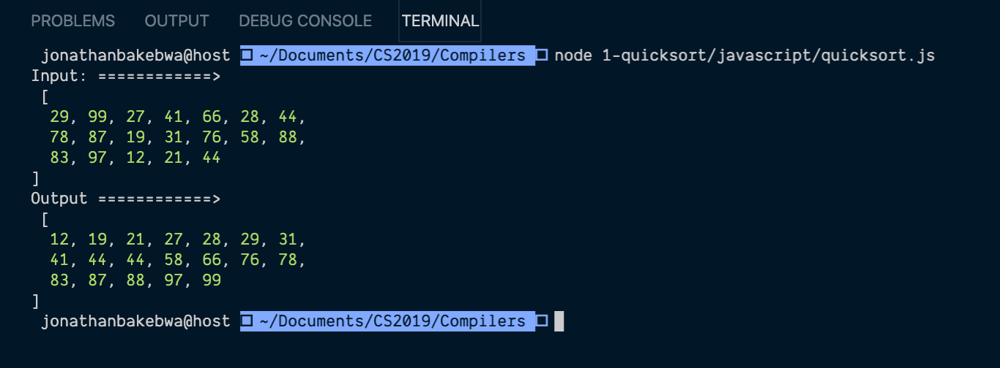
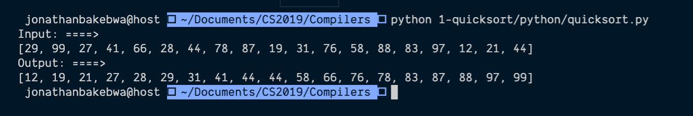

# Assignment 1 - Compilers
The task for this assignment is to use different languages to implement the same algorithm.

### Algorithm
The algorithm chosen to reimplement in this assignment is the quicksort algorithm.

## Languages chosen
The languages chosen for this were:
- Javascript (Node.js)
- Python 3.7

## Output
For both algoithms the same array was used and attached below are the images of the output for both programs:

Input:
```
[29, 99, 27, 41, 66, 28, 44, 78, 87, 19, 31, 76, 58, 88, 83, 97, 12, 21, 44]
```

**Javascript**


**Python**
